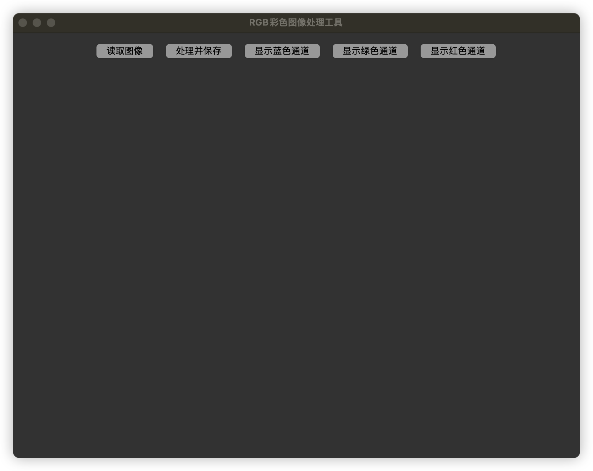
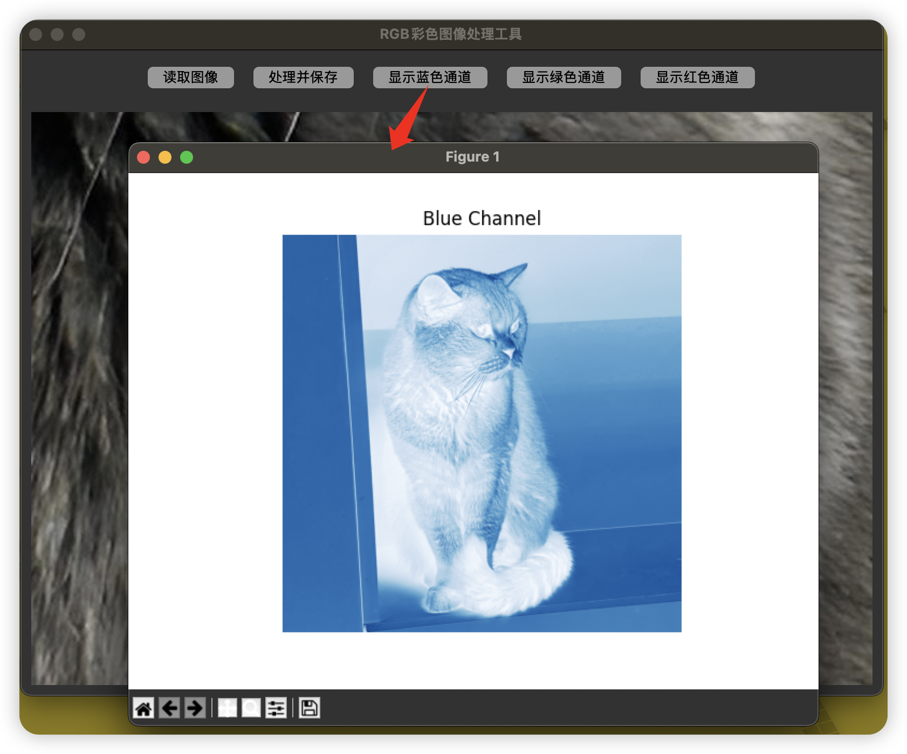
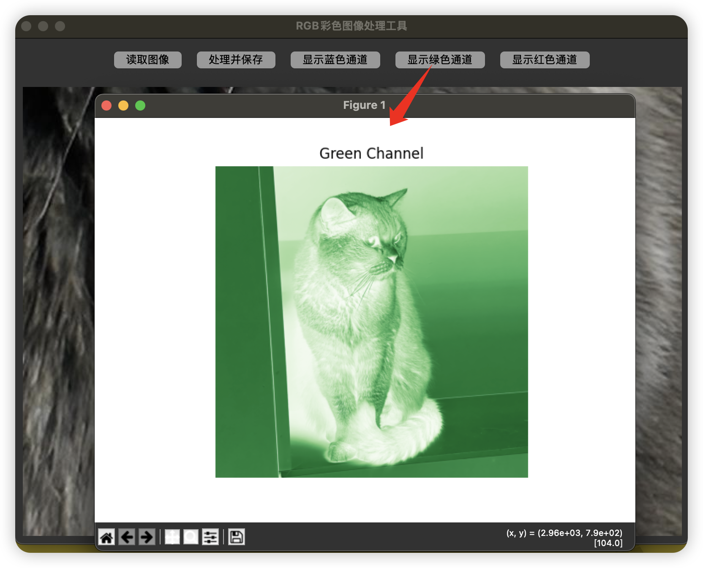
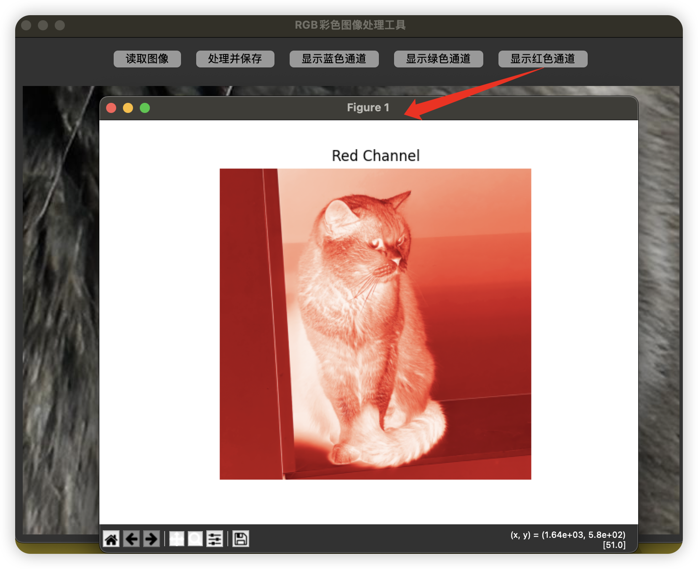

# RGB_Image_Tools
RGB彩色图像处理工具

### 创建conda环境
``` conda create -n Image python=3.9 ```

``` conda activate Image ```
### 安装依赖包
``` pip install -r requirements.txt ```
### 运行程序
``` python main.py ```

主程序界面


RGB蓝色通道


RGB绿色通道


RGB红色通道

